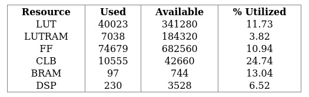
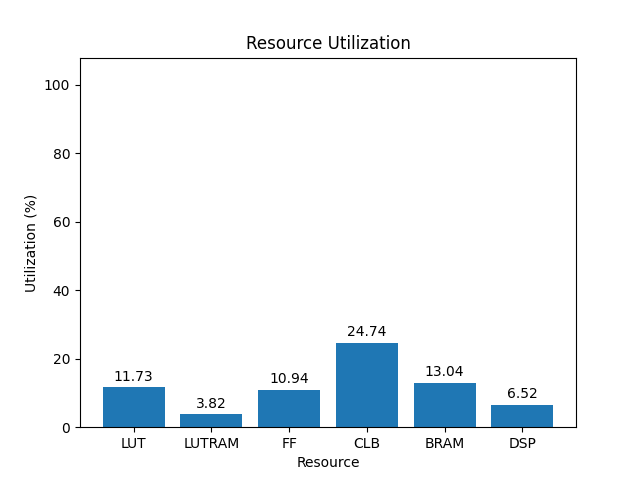
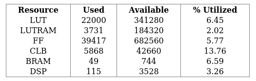
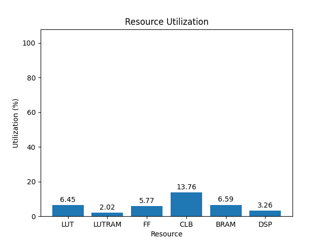

# 15eg

[Back](<../rev4.1.md>)

---

## 3.0
### default-4rx-chan

	

	

`/usr/bin/python ./scripts/gui.py ./utilization/carbon-carp/rev4.1/default-4rx-chan/15eg/3.0/utilization-full.rpt`

### default-chan

	

	

`/usr/bin/python ./scripts/gui.py ./utilization/carbon-carp/rev4.1/default-chan/15eg/3.0/utilization-full.rpt`

