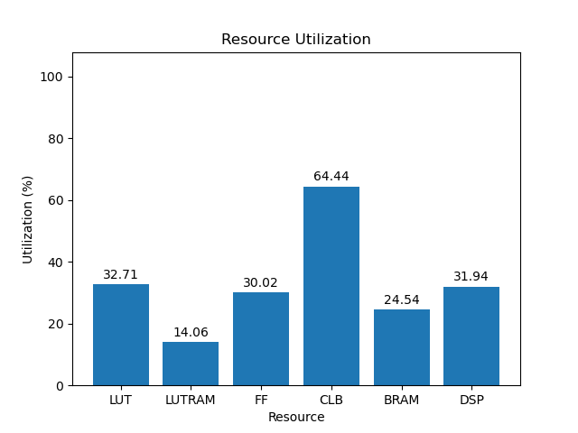

# 3eg

[Back](<../rev4.md>)

---

## 5.0
### default-4rx-chan

	

	

`/usr/bin/python ./scripts/gui.py ./utilization/carbon/rev4/default-4rx-chan/3eg/5.0/utilization-full.rpt`

### default-chan

	

	

`/usr/bin/python ./scripts/gui.py ./utilization/carbon/rev4/default-chan/3eg/5.0/utilization-full.rpt`

