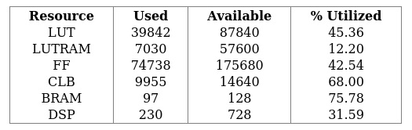
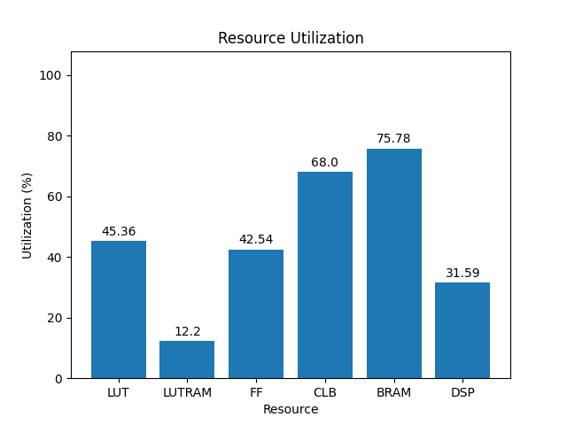
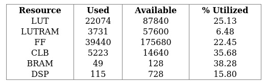
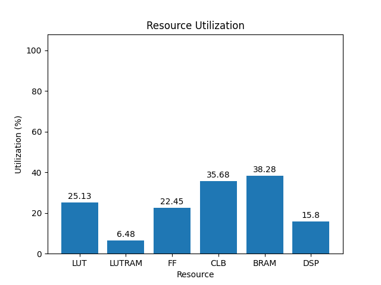

# rev4.1

[Back](<../carbon-carp.md>)

---

## default-4rx-chan

	

	

`/usr/bin/python ./scripts/gui.py ./utilization/carbon-carp/rev4.1/default-4rx-chan/4ev/1.0/utilization-full.rpt`

## default-chan

	

	

`/usr/bin/python ./scripts/gui.py ./utilization/carbon-carp/rev4.1/default-chan/4ev/1.0/utilization-full.rpt`

